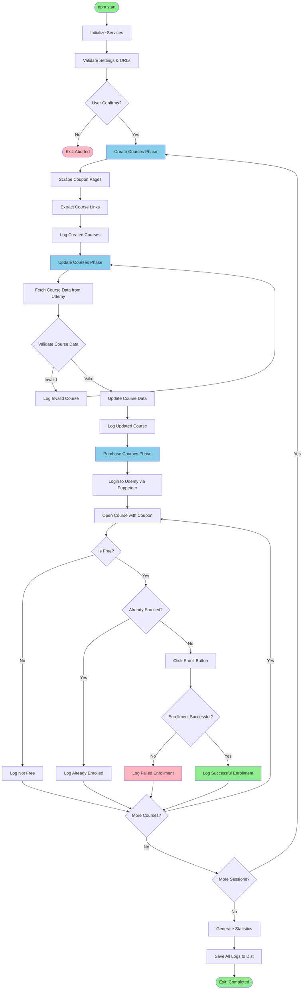

# Udemy Courses Auto-Enroller

A Node.js + Puppeteer.js automation tool that automatically discovers and enrolls in free Udemy courses using coupon codes from coupon websites.

Built in December 2020. This JavaScript application scrapes free course coupons from coupon websites, validates them on Udemy, and automatically enrolls you in truly free courses, helping you build your learning library effortlessly.

## Features

- 🔍 **Automated Course Discovery**: Scrapes free course coupon links from coupon websites
- 🎓 **Auto-Enrollment**: Automatically enrolls in free Udemy courses with valid coupons
- ✅ **Smart Validation**: Validates course data and ensures courses are truly free before enrollment
- 📊 **Comprehensive Logging**: Detailed logs with statistics for all operations
- 🔄 **Session Management**: Retry failed courses automatically with session support
- 🎯 **Keyword Filtering**: Filter courses by specific topics/keywords
- 💾 **Backup Functionality**: Built-in backup system for project files
- 📈 **Real-time Progress**: Live console status with detailed statistics
- 🛡️ **Error Handling**: Robust error handling with retry mechanisms
- 🔐 **Secure Account Management**: Keep credentials in separate JSON files

## Architecture Overview



## Getting Started

### Prerequisites

- Node.js (v12.20.0, v14.13.1, or v16+)
- npm (comes with Node.js)
- A Udemy account
- Internet connection

### Installation

1. Clone the repository:
```bash
git clone https://github.com/orassayag/udemy-courses.git
cd udemy-courses
```

2. Install dependencies:
```bash
npm install
```

3. Configure your Udemy account:
   - Create a JSON file with your credentials:
   ```json
   {
     "email": "your-email@example.com",
     "password": "your-password"
   }
   ```
   - Update `ACCOUNT_FILE_PATH` in `src/settings/settings.js`

4. Configure settings in `src/settings/settings.js`:
```javascript
// Basic configuration
PAGES_COUNT: 2,                       // Pages to scrape
MAXIMUM_COURSES_PURCHASE_COUNT: 3000, // Max enrollments
IS_PRODUCTION_ENVIRONMENT: false,     // Use false for testing
KEYWORDS_FILTER_LIST: [],             // Filter by keywords (empty = all)
```

5. Run the application:
```bash
npm start
```

## Available Scripts

### Start - Main Automation
Run the full automation process:
```bash
npm start
```

### Backup - Create Project Backup
Create a timestamped backup of the project:
```bash
npm run backup
```

### Session - Retry Failed Courses
Test or retry specific course URLs:
```bash
npm run session
```

### Sandbox - Development Testing
Run sandbox tests for development:
```bash
npm run sand
```

## Configuration

### Key Settings in `src/settings/settings.js`

#### General Settings
| Setting | Description | Default |
|---------|-------------|---------|
| `MODE` | Application mode (STANDARD/SESSION/SILENT) | `STANDARD` |
| `COURSES_BASE_URL` | Coupon website URL | `https://www.idownloadcoupon.com` |
| `UDEMY_BASE_URL` | Udemy base URL | `https://www.udemy.com` |
| `PAGES_COUNT` | Number of pages to scrape | `2` |
| `KEYWORDS_FILTER_LIST` | Filter courses by keywords | `[]` |

#### Feature Flags
| Setting | Description | Default |
|---------|-------------|---------|
| `IS_CREATE_COURSES_METHOD_ACTIVE` | Enable course scraping | `true` |
| `IS_UPDATE_COURSES_METHOD_ACTIVE` | Enable course updates | `true` |
| `IS_PURCHASE_COURSES_METHOD_ACTIVE` | Enable auto-enrollment | `true` |

#### Limits & Timeouts
| Setting | Description | Default |
|---------|-------------|---------|
| `MAXIMUM_COURSES_PURCHASE_COUNT` | Maximum enrollments | `3000` |
| `MAXIMUM_SESSIONS_COUNT` | Retry sessions | `5` |
| `MILLISECONDS_TIMEOUT_BETWEEN_COURSES_PURCHASE` | Delay between enrollments | `5000ms` |

## Project Structure

```
udemy-courses/
├── src/
│   ├── core/
│   │   ├── enums/          # Status enums and constants
│   │   └── models/         # Data models
│   ├── logics/             # Business logic
│   │   ├── backup.logic.js
│   │   └── purchase.logic.js
│   ├── scripts/            # Entry point scripts
│   │   ├── backup.script.js
│   │   ├── purchase.script.js
│   │   └── initiate.script.js
│   ├── services/           # Service layer
│   │   ├── account.service.js
│   │   ├── course.service.js
│   │   ├── puppeteer.service.js
│   │   ├── createCourse.service.js
│   │   ├── updateCourse.service.js
│   │   └── purchaseCourse.service.js
│   ├── settings/           # Configuration
│   │   └── settings.js
│   └── utils/              # Utility functions
├── dist/                   # Generated logs and output
├── misc/                   # Documentation and backups
├── package.json
└── README.md
```

## How It Works

### 1. Create Courses Phase
- Scrapes configured number of pages from coupon website
- Extracts course URLs and coupon codes
- Validates and stores course information
- Logs all discovered courses

### 2. Update Courses Phase
- Validates each course URL on Udemy
- Fetches detailed course information
- Checks if course is accessible and free with coupon
- Updates course data and filters invalid courses

### 3. Purchase Courses Phase
- Logs into Udemy using Puppeteer (headless browser)
- Navigates to each course with its coupon code
- Verifies the course is truly free (₪0 / $0)
- Clicks "Enroll" button if not already enrolled
- Logs success/failure for each enrollment

## Output Files

All logs are saved in the `dist/` directory with the following structure:

```
dist/
└── [SESSION_ID]_[DATE]_[TIME]/
    ├── create_courses_method_valid.txt      # Successfully scraped courses
    ├── create_courses_method_invalid.txt    # Failed scraping attempts
    ├── update_courses_method_valid.txt      # Valid course data from Udemy
    ├── update_courses_method_invalid.txt    # Invalid/inaccessible courses
    ├── purchase_courses_method_valid.txt    # Successfully enrolled courses
    └── purchase_courses_method_invalid.txt  # Failed enrollment attempts
```

## Console Output Example

```
===IMPORTANT SETTINGS===
EMAIL: your****@example.com
MODE: STANDARD
PAGES_COUNT: 2
MAXIMUM_COURSES_PURCHASE_COUNT: 3000
========================

===INITIATE THE SERVICES===
===VALIDATE GENERAL SETTINGS===

===[SETTINGS] Environment: PRODUCTION | Method: PURCHASE COURSES | Pages Count: 2===
===[GENERAL1] Time: 00.00:15:32 | Course: 45/45 (100.00%) | Courses Count: 45===
===[GENERAL2] Total Courses Price: ₪1,250.80 | Total Purchase Price: ₪0.00===
===[ACCOUNT] Email: your****@example.com===
===[PROCESS1] Purchase: ✅ 42 | Fail: ❌ 1 | Filter: 2 | Duplicate: 0===
===[PROCESS2] Create Update Error: 0 | Not Exists: 0 | Page Not Found: 0===
===[PROCESS3] Already Purchase: 0 | Course Price Not Free: 0===
===[NAME] Complete JavaScript Masterclass 2024===
===[UDEMY URL] https://www.udemy.com/course/javascript-complete/?couponCode=ABC123===
===[RESULT] Course has been purchased successfully.===

===EXIT: FINISH===
```

## Troubleshooting

### Common Issues

| Issue | Solution |
|-------|----------|
| No courses found | Check `COURSES_BASE_URL` is accessible and `PAGES_COUNT` is set |
| Login failed | Verify credentials in account JSON file |
| Courses not enrolling | Ensure courses are truly free; check console for errors |
| Rate limiting | Increase timeouts, reduce `PAGES_COUNT` |
| Selector errors | Udemy may have updated UI; check for updates or open an issue |

## Best Practices

1. ✅ Start with `PAGES_COUNT: 1` for testing
2. ✅ Use `IS_PRODUCTION_ENVIRONMENT: false` initially
3. ✅ Set reasonable `MAXIMUM_COURSES_PURCHASE_COUNT`
4. ✅ Keep credentials in separate JSON file (never commit)
5. ✅ Monitor `dist/` logs for detailed information
6. ✅ Run `npm run backup` before major changes
7. ✅ Respect Udemy's Terms of Service

## Legal & Ethical Use

⚠️ **Important Notice:**
- Only use for courses that are legitimately free with valid coupons
- Respect Udemy's Terms of Service
- Don't abuse the system or use for commercial purposes
- Use responsibly to build your personal learning library

## Contributing

Contributions to this project are [released](https://help.github.com/articles/github-terms-of-service/#6-contributions-under-repository-license) to the public under the [project's open source license](LICENSE).

Everyone is welcome to contribute. See [CONTRIBUTING.md](CONTRIBUTING.md) for guidelines.

## Development

Built with:
- **Node.js** - JavaScript runtime
- **Puppeteer** - Headless browser automation
- **JSDOM** - HTML parsing
- **fs-extra** - Enhanced file system operations

## Author

* **Or Assayag** - *Initial work* - [orassayag](https://github.com/orassayag)
* Or Assayag <orassayag@gmail.com>
* GitHub: https://github.com/orassayag
* StackOverflow: https://stackoverflow.com/users/4442606/or-assayag?tab=profile
* LinkedIn: https://linkedin.com/in/orassayag

## License

This application has an MIT license - see the [LICENSE](LICENSE) file for details.

## Acknowledgments

- Puppeteer team for excellent browser automation
- Coupon websites providing free educational opportunities
- Udemy for their platform and free course offerings

---

**Disclaimer**: This tool is for educational purposes and personal use only. Always respect the terms of service of websites you interact with.
